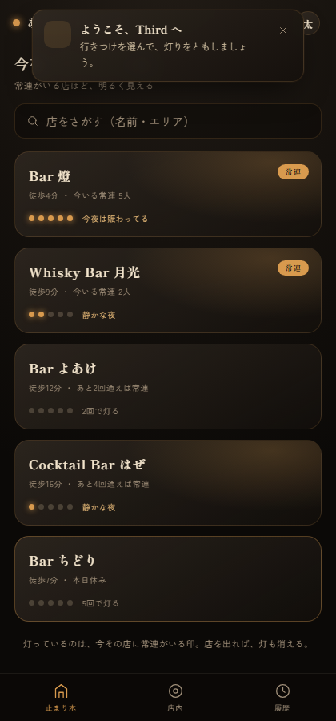
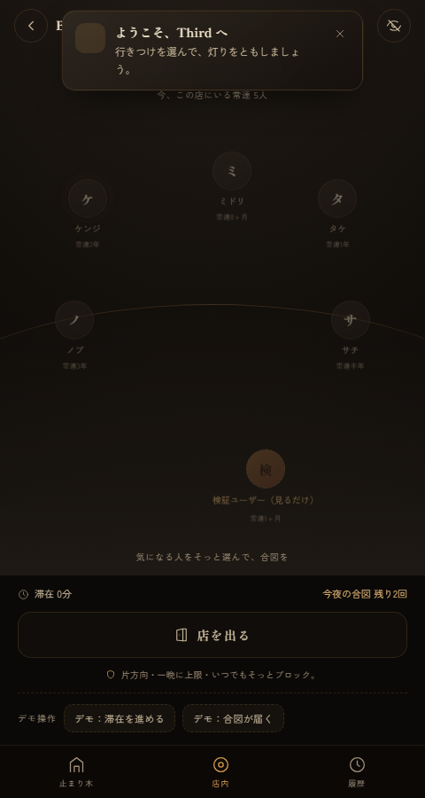
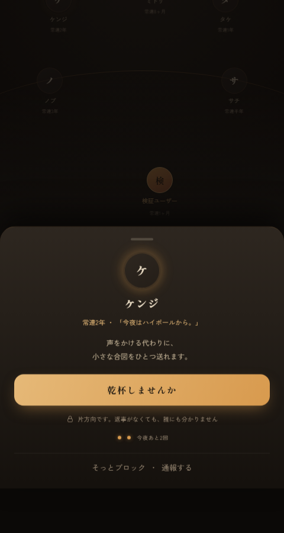
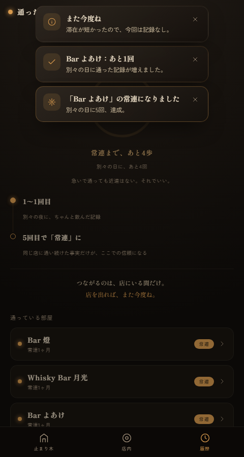

# Third — カウンターの灯り

> 行きつけのバーにいる間だけ、同じ店に通い続けた常連同士が、ゆるい合図で知り合えるSNS。
> **店を出れば関係はそっと消える。** 盛らない。追ってこない。気楽。

要件定義書・企画書・デザイン（`docs/`）にもとづく **MVP v0.1 のインタラクティブ・プロトタイプ**です。
ビルド不要のバニラ HTML / CSS / JS で、ブラウザでそのまま動きます（PWA インストール対応）。

**店種**: バー（オーセンティック／ウイスキー／カクテル）。 **世界観**: 「止まり木」「カウンターの灯り」「ウイスキーの琥珀」。
**対象**: スマホ優先 / Web・iOS・Windows。 **技術**: バニラ HTML/CSS/JS・ビルド不要・PWA・Vercel。

---

## 体験できること（コア体験）

| # | フロー | 実装 |
| --- | --- | --- |
| 1 | **チェックイン** | 止まり木（ホーム）→ 店を選ぶ → 「この店にチェックイン」。位置情報の確認はモック。`L-2/L-3/L-4` |
| 2 | **今いる常連が見える** | 店内画面でカウンターを囲む常連が見える。`S-1` |
| 3 | **ゆるい合図** | 常連を選んで「乾杯しませんか」。**片方向・一晩に上限（既定2回）**。`S-2/S-3` |
| 4 | **合図の受信** | 在店中、相手から合図が届く。無視しても相手に伝わらない／そっとブロック可。`S-4/F-1` |
| 5 | **その場限り** | 「店を出る」と合図のやりとりは破棄。**通った記録（常連認定）だけが残る。** |
| 6 | **常連認定** | 別々の日に5回・各回30分以上で「常連」に昇格。履歴のリングで進捗が見える。`R-1/R-2/R-3` |
| 7 | **安全 / プライバシー** | こっそりチェックイン、可視性は安全側がデフォルト、ブロック、通報。`F-1/F-2/F-3` |

> 「通った時間が、信頼になる」を体感できるよう、店内とプロフィールに**デモ操作**（滞在を進める／別の日に通う／合図が届く／リセット）を用意しています。プロトタイプ用の足場で、製品機能ではありません。

---

## 動かし方

ビルド不要です。次のいずれか：

- **そのまま開く**: `index.html` をダブルクリック（localStorage で状態が保存されます）。
- **ローカルサーバ（推奨：Service Worker / PWA を試すなら）**:
  ```bash
  npx serve .        # もしくは  python -m http.server 8000
  ```
  ブラウザで表示 → デスクトップ Chrome なら「インストール」でアプリ化（Windows 対応）。

PC ではスマホ実機を模した端末フレーム内に、スマホ幅では全画面で表示されます（スマホ優先設計）。

---

## 画面

| 止まり木（ホーム） | 店内（今いる常連） | ゆるい合図 | 常連の証（履歴） |
| --- | --- | --- | --- |
|  |  |  |  |

すべて実機を模した端末フレーム内の実描画です（バー仕様）。`docs/` に各画面・320px 幅・常連昇格演出のスクリーンショットがあります。

---

## 構成

```
Third/
├─ index.html              # エントリ（端末フレーム + #app）
├─ manifest.webmanifest    # PWA マニフェスト
├─ sw.js                   # Service Worker（オフライン起動）
├─ vercel.json             # Vercel 配信設定
├─ assets/icon.svg         # アプリアイコン（灯り）
├─ css/
│  ├─ tokens.css           # デザイントークン（墨色の闇／琥珀／灯火）・基底・a11y
│  ├─ app.css              # 端末フレーム・共通UI（ボタン/フォーム/トースト/シート）
│  └─ screens.css          # 画面別（止まり木 / 店内 / 履歴）
├─ js/
│  ├─ data.js              # 部屋・常連・コピー（シード）
│  ├─ state.js             # 状態と業務ロジック（チェックイン/常連判定/合図/その場限り）
│  ├─ icons.js             # 線画アイコン
│  ├─ ui.js                # トースト・小物
│  ├─ screens.js           # 各画面の描画
│  └─ app.js               # 起動・ルーティング・イベント
└─ docs/                   # 企画書・要件定義書・デザイン（原典）＋ スクリーンショット＋ E2Eテスト(verify.py)
```

設計の正典は `docs/Third_要件定義書.md`。デザイントークンと文言は `docs/Third_デザイン.html` を踏襲しています。

### データモデル（要点）

- **部屋（店）**= バー1軒。`presentNow` が「今いる常連」。
- **常連認定**: `別々の日に5回 × 各回30分以上の滞在`（`state.js` の `validDays`／`isRegular`）。
- **合図の上限**: 一晩に既定2回。**夜単位で永続**（`state.nightSignals`）し、再チェックインしても戻らない（要件 §7.2.1 の最重要ブレーキ）。
- **その場限り**: 退店で `session` を破棄。合図のやりとりは残らず、**通った記録だけ**が残る（要件 §6.3）。

---

## 設計の芯（要件 §2.1）

場所主軸・常連限定・その場限り・片方向の合図——すべてが
**「気軽だけど安全な常連の場」** という一点に向かって整列しています。
「つながりっぱなしのSNS」への、構造的なアンチテーゼ。

## 非機能（要件 §6.2）

- レスポンシブ：スマホ最小幅まで破綻しない
- アクセシビリティ：キーボードフォーカス可視・`prefers-reduced-motion` 尊重・コントラスト確保
- ダークモードを第一級（店内＝夜の利用が主）
- 体感パフォーマンス：チェックイン→常連リスト表示まで即時

---

## 検証（テスト）

- **ドメインロジック**（`js/state.js`）: Node 上で `window`/`localStorage` をスタブし、チェックイン→滞在判定→常連認定、合図の一晩上限（夜単位で永続＝再チェックインで戻らない）、こっそりの送信ゲート、その場限りリセットをユニット検証。
- **ブラウザ E2E**（`docs/verify.py`, Playwright）: オンボーディングから合図・常連昇格まで **21 チェック**を実機ヘッドレスで通過（**コンソールエラー 0**）。
  ```bash
  python -m http.server 5173        # 別ターミナルで配信
  pip install playwright && python docs/verify.py
  ```
- 多観点（要件適合 / ロジック / アクセシビリティ / デザイン整合 / レスポンシブ / インジェクション安全）でレビューし、指摘 **19 件**を反映済み。

---

## このプロトタイプの範囲

- 認証・GPS・リアルタイム購読・プッシュ通知・バックエンドは **モック**（要件 §11 では Flutter + Supabase/Firebase を推奨）。
- 本実装では単一コードベースのクロスプラットフォーム（Flutter）を想定。本リポジトリは、その世界観と P0 コア体験を確かめるための Web プロトタイプです。
- データはすべて端末内（localStorage）。「最初から」で初期化できます。
